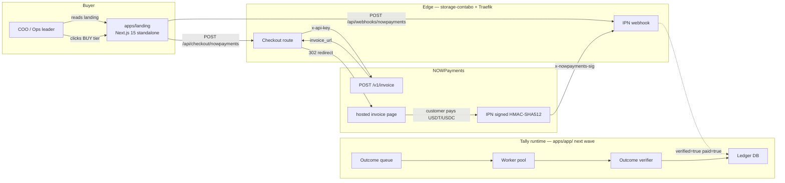
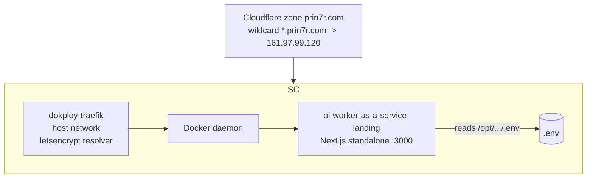

# 02 — Architecture: Tally

This document describes the system as it stands today (Wave 2: marketing landing + checkout) and the runtime that ships next wave (the worker fleet behind the receipts).

## High-level diagram (mermaid)

## Components

### `apps/landing/` (this wave)

- **Stack:** Next.js 15.1 (App Router), React 19, Tailwind 3.4, TypeScript 5.7, no client-side framework beyond React. Standalone build for Docker.
- **Routes:**
  - `GET /` — single-page editorial landing. All eight zones (masthead, hero, catalog, pricing table, verification, tiers, FAQ, footer) are server-rendered components with no client JS except the BUY button click handler.
  - `POST /api/checkout/nowpayments` — accepts `{ plan: "trial" | "standard" | "enterprise" }`, calls NOWPayments `POST /v1/invoice` server-side, returns `{ invoice_url, invoice_id }`. Returns HTTP 503 with `{ error: "missing_env", missing, message }` if `NOWPAYMENTS_API_KEY` is unset.
  - `POST /api/webhooks/nowpayments` — verifies the HMAC-SHA512 IPN signature against `NOWPAYMENTS_IPN_SECRET`. HTTP 401 on mismatch, HTTP 200 with `{ ok, paid, order_id, status }` on a verified payload. Logs the verified event to stdout (no payload echo).
- **State:** none. The landing is stateless; the only persistent record of an order before `apps/app/` ships is what NOWPayments holds and what storage-contabo's journalctl captures from the IPN log line.

### `apps/app/` (stub for next wave)

A `.gitkeep` and `README.md` only. The plan is to fork [`wasp-lang/open-saas`](https://github.com/wasp-lang/open-saas) here and build:
- Auth (Wasp default)
- Org / workspace model with API tokens
- Outcome contract objects (worker profile, deliverable target, unit price, contract term)
- Worker pool (a queue + LangGraph worker template per profile)
- Outcome verifier (per-profile verification rule: e.g. SDR shift = "lead has been contacted with at least one personalized message"; CS shift = "ticket has a resolution status set by the customer")
- Ledger + receipts (the user-facing analog of the receipt rendered on the landing)
- Billing reconciliation against NOWPayments invoices (one invoice per cleared shift)

## Data flows

### Landing → unpaid invoice

1. Buyer clicks **BUY** on the Standard tier.
2. Browser fetches `POST /api/checkout/nowpayments { plan: "standard" }`.
3. Server constructs a unique `order_id = tally_standard_<ts>_<rand>` and POSTs to `https://api.nowpayments.io/v1/invoice` with `x-api-key`.
4. NOWPayments returns `{ id, invoice_url, ... }`.
5. Server returns `{ invoice_url, invoice_id }` to the browser.
6. Browser navigates to `invoice_url` (`https://nowpayments.io/payment/?iid=<id>`).

The cleared invoice path (next wave): NOWPayments POSTs to `/api/webhooks/nowpayments` with a signed payload. Once `apps/app/` exists, that handler writes a row to the ledger DB, marks the order paid, and triggers the worker shift.

### Failure modes

| Path | Failure | What the buyer sees |
|---|---|---|
| `POST /api/checkout/nowpayments` | `NOWPAYMENTS_API_KEY` unset | HTTP 503 + visible message: "NOWPayments is not configured on this deployment yet. Email desk@ai-worker-as-a-service.prin7r.com and we'll hand-issue the receipt." |
| `POST /api/checkout/nowpayments` | NOWPayments returns non-2xx | HTTP 502 + "We couldn't open a receipt with NOWPayments just now. Try again, or email desk@... ." |
| `POST /api/webhooks/nowpayments` | Signature fails verification | HTTP 401, no buyer-visible effect |
| `POST /api/webhooks/nowpayments` | `NOWPAYMENTS_IPN_SECRET` unset | HTTP 503 (operator gap) |

## Deploy topology

- **Hostname:** `ai-worker-as-a-service.prin7r.com` resolves via the existing wildcard A record. No per-host DNS.
- **TLS:** Let's Encrypt HTTP-01 via Traefik resolver `letsencrypt`, email `kee22r@gmail.com`.
- **Container port:** 3000 internal, exposed only via `expose:` (not `ports:`); Traefik discovers it through Docker provider.
- **Restart policy:** `unless-stopped`.
- **Build:** Multi-stage Dockerfile (deps → builder → runner) producing a Next.js standalone image, ~110 MB compressed.

## Security & secrets

- `NOWPAYMENTS_API_KEY` and `NOWPAYMENTS_IPN_SECRET` are stored only in `/opt/prin7r-deploys/ai-worker-as-a-service/.env` on storage-contabo. They are **never** checked into the repo. `.env.example` lists names only.
- The IPN handler always verifies HMAC-SHA512 against the alphabetically sorted JSON before treating any payload as truthful. `timingSafeEqual` is used for the comparison to defeat timing-side-channel attacks.
- `console.log` statements never include the API key; the IPN handler logs the verified `order_id` and `status` only.
- The checkout route returns HTTP 503 with a brand-voice message rather than crashing or leaking which env name is missing in production-style errors. (For developer ergonomics, the missing var name is included in the JSON response body so an operator running `curl` sees the gap immediately.)

## Open architectural questions (for next wave)

- **Worker substrate.** LangGraph + a per-profile graph, or a flat supervisor + worker pattern. Decision deferred to the `apps/app/` wave.
- **Outcome verifier.** Per-profile rules (e.g. CS = customer-set resolution status), with an option for buyer-supplied rules.
- **Settlement cadence.** Real-time per-outcome charge vs. weekly batch. The receipt metaphor argues for batch ("this week's shift cleared X of Y").
