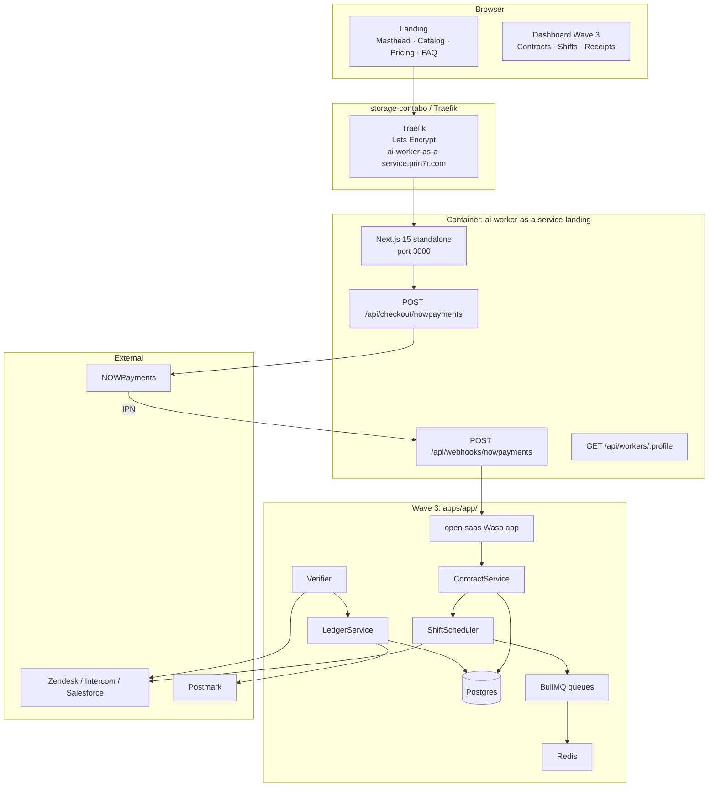
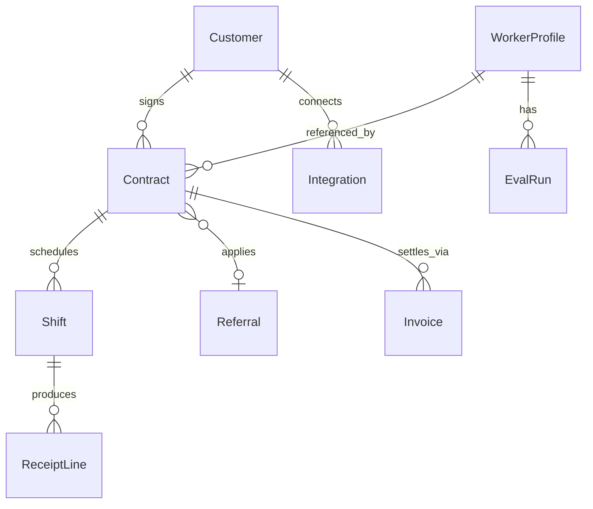

# 12 — Technical Specification

This is the authoritative technical contract for Shiftledger Wave 2 → Wave 3. Doc 11 specifies user-visible flows; this doc specifies runtime, schema, contracts, and operational guardrails. Every endpoint here traces back to a story in doc 11. Every entity here is the canonical name to be used in code.

---

## 1. Architecture overview

The Wave 2 surface is a Next.js 15 (App Router) marketing landing with two server routes (checkout + webhook). Wave 3 expands into `apps/app/` — an open-saas-derived runtime that owns the contract / shift / verifier / ledger model.



Wave 2: stateless landing only; ledger / contract / shift live on NOWPayments + journalctl.
Wave 3: full ledger and worker fleet in `apps/app/`.

---

## 2. Data model

### 2.1 Entities



### 2.2 Schema sketch (Drizzle, Postgres)

```typescript
// apps/app/src/db/schema.ts
export const customers = pgTable('customers', {
  id: uuid('id').primaryKey().defaultRandom(),
  email: text('email').notNull().unique(),
  orgName: text('org_name'),
  agencyPartnerCode: text('agency_partner_code'),
  createdAt: timestamp('created_at').defaultNow(),
});

export const workerProfiles = pgTable('worker_profiles', {
  id: text('id').primaryKey(),       // 'cs-shift', 'sdr-shift', ...
  displayName: text('display_name').notNull(),
  category: text('category').notNull(),       // 'cs'|'sdr'|'research'|'content'
  unitPriceUsd: numeric('unit_price_usd', {precision:10,scale:2}).notNull(),
  verificationRule: jsonb('verification_rule').notNull(),  // structured, not freeform
  baselineClearRate: numeric('baseline_clear_rate', {precision:5,scale:4}),
  driftStatus: text('drift_status').default('green'),
});

export const contracts = pgTable('contracts', {
  id: text('id').primaryKey(),       // 'shiftledger_standard_<ts>_<rand>'
  customerId: uuid('customer_id').references(() => customers.id),
  workerProfileId: text('worker_profile_id').references(() => workerProfiles.id),
  tier: text('tier').notNull(),               // 'trial'|'standard'|'enterprise'
  status: text('status').default('pending'),  // 'pending'|'active'|'paused'|'completed'|'cancelled'
  outcomeTarget: integer('outcome_target').notNull(),  // e.g. 350
  unitPriceUsd: numeric('unit_price_usd', {precision:10,scale:2}).notNull(),
  budgetCapUsd: numeric('budget_cap_usd', {precision:10,scale:2}),
  termMonths: integer('term_months').default(1),
  autoRenew: boolean('auto_renew').default(false),
  referralCode: text('referral_code'),
  activatedAt: timestamp('activated_at'),
  expiresAt: timestamp('expires_at'),
  createdAt: timestamp('created_at').defaultNow(),
});

export const shifts = pgTable('shifts', {
  id: uuid('id').primaryKey().defaultRandom(),
  contractId: text('contract_id').references(() => contracts.id),
  status: text('status').default('queued'),    // 'queued'|'running'|'paused'|'completed'|'stuck'
  startedAt: timestamp('started_at'),
  endedAt: timestamp('ended_at'),
  outcomesAttempted: integer('outcomes_attempted').default(0),
  outcomesCleared: integer('outcomes_cleared').default(0),
  outcomesVoided: integer('outcomes_voided').default(0),
});

export const receiptLines = pgTable('receipt_lines', {
  id: uuid('id').primaryKey().defaultRandom(),
  shiftId: uuid('shift_id').references(() => shifts.id),
  externalId: text('external_id'),  // ticket id / lead id in source-of-truth
  status: text('status').notNull(),  // 'cleared'|'voided'|'disputed'|'escalated'
  clearedAt: timestamp('cleared_at'),
  voidedAt: timestamp('voided_at'),
  disputedAt: timestamp('disputed_at'),
  unitPriceUsd: numeric('unit_price_usd', {precision:10,scale:2}),
  verificationDetails: jsonb('verification_details'),
});

export const integrations = pgTable('integrations', {
  id: uuid('id').primaryKey().defaultRandom(),
  customerId: uuid('customer_id').references(() => customers.id),
  kind: text('kind').notNull(),          // 'zendesk'|'intercom'|'salesforce'|'hubspot'
  apiTokenEncrypted: text('api_token_encrypted').notNull(),
  status: text('status').default('healthy'),  // 'healthy'|'expired'|'degraded'
  lastHeartbeatAt: timestamp('last_heartbeat_at'),
});

export const evalRuns = pgTable('eval_runs', {
  id: uuid('id').primaryKey().defaultRandom(),
  workerProfileId: text('worker_profile_id').references(() => workerProfiles.id),
  weekStart: date('week_start').notNull(),
  clearRate: numeric('clear_rate', {precision:5,scale:4}),
  voidRate: numeric('void_rate', {precision:5,scale:4}),
  sampleSize: integer('sample_size'),
});
```

Indexes: `contracts(customer_id, status)`, `shifts(contract_id, status)`, `receiptLines(shift_id, status)`, `integrations(customer_id, kind)`, `evalRuns(worker_profile_id, week_start)`.

---

## 3. API contracts

All endpoints return JSON. Errors use `{ error: { code, message, details? } }` with HTTP 4xx/5xx.

### 3.1 `GET /api/workers/:profileId`

- Auth: none.
- Response 200: `{ id, displayName, category, unitPriceUsd, verificationRule, baselineClearRate, driftStatus, recentEvalsSummary }`.
- Errors: 404 `worker_not_found`.

### 3.2 `POST /api/checkout/nowpayments`

- Auth: none.
- Body: `{ plan: 'trial'|'standard'|'enterprise', workerProfile: string, referralCode?: string, contractId?: string }`.
- Server flow: build `contractId = shiftledger_<plan>_<ts>_<rand>` (or reuse `contractId` if provided for upgrade); build NOWPayments payload `{ price_amount, price_currency: 'usd', order_id: contractId, order_description, ipn_callback_url, success_url, cancel_url }`; call NOWPayments; return `{ invoice_url, invoice_id, contractId }`.
- Response 201: `{ invoice_url, invoice_id, contractId }`.
- Response 503: `{ error: { code: 'missing_env', missing: ['NOWPAYMENTS_API_KEY'], message } }` (operator gap, brand-voice copy).
- Response 502: `{ error: { code: 'nowpayments_unavailable' } }`.

### 3.3 `POST /api/webhooks/nowpayments`

- Auth: HMAC-SHA512 in `x-nowpayments-sig` over alphabetically-sorted JSON body, signed with `NOWPAYMENTS_IPN_SECRET`. Constant-time compare.
- Body: NOWPayments IPN.
- Server flow: verify sig → look up contract by `order_id` → if `payment_status == 'finished'`, mark contract `active`, schedule first shift, accrue rev-share if `referralCode` present, send activation email.
- Response 200 `{ ok, paid, order_id, status }` on verified payload. 401 on bad sig. 200 on idempotent replay.

### 3.4 `POST /api/contracts` (Wave 3)

- Auth: Bearer customer JWT.
- Body: `{ workerProfile, tier, outcomeTarget, budgetCapUsd?, termMonths, autoRenew }`.
- Response 201: `{ contractId, status: 'pending', invoiceUrl }`.

### 3.5 `GET /api/contracts/:contractId` (Wave 3)

- Auth: Bearer customer JWT (must own contract).
- Response 200: contract + linked shifts + cleared/voided counts + reconciliation status.

### 3.6 `POST /api/integrations` (Wave 3)

- Auth: Bearer customer JWT.
- Body: `{ kind: 'zendesk'|'intercom'|'salesforce'|'hubspot', apiToken }`.
- Server flow: encrypt token (KMS or AES-256-GCM with `INTEGRATION_KEY`), store row, fire heartbeat to validate.
- Response 201: `{ integrationId, status: 'healthy' }`.
- Errors: 400 `unsupported_kind`, 401 `invalid_api_token` (heartbeat failed).

### 3.7 `GET /api/workers/:profileId/evals?since=90d`

- Auth: none.
- Response 200: `{ profileId, runs: [{ weekStart, clearRate, voidRate, sampleSize }, …], baseline, current30dMean }`.

### 3.8 `POST /api/shifts/:shiftId/escalate` (Wave 3)

- Auth: Bearer customer JWT (must own contract).
- Body: `{ reason }`.
- Response 200: `{ shiftId, escalatedAt, eta: '24h' }`.

### 3.9 `POST /api/receipts/:lineId/dispute` (Wave 3)

- Auth: Bearer customer JWT.
- Body: `{ reason }`.
- Response 200: `{ lineId, status: 'disputed', resolution: 'pending' }`.

### 3.10 `POST /api/admin/contracts` (Wave 3)

- Auth: Bearer `ADMIN_API_KEY`.
- Body: `{ customerId, workerProfile, tier: 'enterprise', outcomeTarget, budgetCapUsd, termMonths }`.
- Response 201: `{ contractId, invoiceUrl }`.

---

## 4. Integrations

| Service | Purpose | Auth | Rate limit | Fallback |
|---|---|---|---|---|
| **NOWPayments** | Hosted invoice + IPN; fiat-on-ramp partner for USD invoices | `x-api-key: NOWPAYMENTS_API_KEY`; IPN HMAC-SHA512 | 60 req/min | 502 retry 3x; brand-voice toast |
| **Zendesk** | CS shift source-of-truth | OAuth or API token (customer-supplied) | 700 req/min/agent | Auto-pause on 3 consecutive heartbeat failures |
| **Intercom** | CS shift alternative | OAuth | 1k req/min | Same as above |
| **Salesforce** | SDR shift source-of-truth | OAuth (customer-supplied) | varies by edition | Same as above |
| **HubSpot** | SDR alternative | API token (private app) | 100 req/10s | Same as above |
| **OpenAI / Anthropic / Bedrock** | Worker LLM substrate | Customer-supplied or platform-owned (per profile) | per provider | Falls back to platform-owned with a flat per-outcome surcharge |
| **Postmark / Resend** | Receipts + digests | Server token | 5k/h Pro | BullMQ retry on 5xx |
| **Plisio** | Backup stablecoin invoice (Wave 4) | API key | n/a | Hidden in Wave 2/3 |

---

## 5. Storage

- **Wave 2.** No DB. Stateless landing; orders held by NOWPayments; logs in journalctl.
- **Wave 3 MVP.** SQLite at `/opt/prin7r-deploys/ai-worker-as-a-service/data/app.sqlite`; Drizzle migrations.
- **Wave 3 production.** Postgres 15 on storage-contabo (or managed Neon if traffic warrants).
- **Encryption at rest.** Integration tokens encrypted with `INTEGRATION_KEY` (AES-256-GCM); `NOWPAYMENTS_*` keys never stored in DB.
- **Retention.**
  - Receipts: 7 years (tax compliance).
  - Shift logs: 24 months.
  - Webhook receipts: 30 days in stdout, 90 days in DB.
  - PII (email, org name): GDPR-DSAR compliant.

---

## 6. Auth

- **Public landing.** No auth.
- **Customer dashboard (Wave 3).** Magic-link email auth. Session cookie httpOnly, secure, samesite=lax, 30-day TTL.
- **Admin endpoints.** Bearer `ADMIN_API_KEY`, rotated every 90 days, scoped to a single human operator.
- **Integration tokens.** Customer pastes their own API token; encrypted at rest; rotated by customer (we never store the rotation cadence).
- **No SSO.** Defers to Wave 4 if Enterprise pipeline > 5 named.

---

## 7. Security

Top 5 threats + mitigations:

1. **Forged IPN.** *Mitigation:* HMAC-SHA512 with constant-time compare. Reject any IPN whose `order_id` we did not create. Log + alert on rejections.
2. **Replay of IPN.** *Mitigation:* Idempotent on `(order_id, payment_status)`; ledger rejects same `(contractId, 'finished')` after first acceptance.
3. **Customer integration-token leak.** *Mitigation:* Encrypted at rest with `INTEGRATION_KEY`; never logged; never emitted in API responses; surface only `kind` + `status` in dashboard. Rotation tokens are one-time.
4. **Worker hallucinating a cleared outcome.** *Mitigation:* Every cleared line MUST have a verification event from the source-of-truth (e.g. Zendesk ticket resolution-status set by customer). No verifier event → no clear. Audit by sampling 1% of cleared lines weekly.
5. **Brute-force on admin endpoints.** *Mitigation:* Bearer-only, no cookie auth on `/api/admin/*`. Traefik rate limit 10 req/min/IP. Failures → Slack alert.

CSRF: Next.js default + samesite=lax. CORS: `Access-Control-Allow-Origin` set to `https://ai-worker-as-a-service.prin7r.com` only. Rate limits at Traefik: `/api/checkout/*` 30 req/min/IP, `/api/webhooks/*` 600 req/min total.

---

## 8. Observability

- **Logs.** Stdout JSON `{ ts, level, route, contractId?, shiftId?, event, message }`. PII scrubbed at line-format step.
- **Metrics.** Wave 3: Prometheus counters: `contracts_created_total`, `contracts_activated_total`, `shifts_running`, `shifts_stuck`, `receipt_lines_cleared_total`, `receipt_lines_voided_total`, `webhook_verifications_failed_total`.
- **Alerts.**
  - Webhook sig failures >5/h → Slack `#alerts-shiftledger`.
  - Shifts stuck >24h → Slack.
  - Worker-profile clear-rate drops >5pp below baseline for 3 days → Slack + auto-set `driftStatus = 'yellow'`.
  - Daily contracts created <2σ below 30-day mean → Slack (anomaly).
- **Trace propagation.** `requestId` UUID minted at edge, propagated via `x-request-id`.

---

## 9. Performance budgets

| Surface | Metric | Budget |
|---|---|---|
| Landing TTFB | p95 | <200ms |
| Landing LCP | p75 | <2.5s |
| `POST /api/checkout/nowpayments` | p95 | <1.5s end-to-end |
| `POST /api/webhooks/nowpayments` | p95 | <250ms |
| `GET /api/workers/:id` | p95 | <100ms |
| `POST /api/contracts` (Wave 3) | p95 | <500ms |
| Shift scheduling latency | p95 | <60s from contract activation |
| Verification latency | p95 | <5s from external state change |
| Throughput (sustained) | landing 50 RPS, checkout 10 RPS, webhook 100 RPS, internal verifier 50 RPS |

---

## 10. Non-goals

- **No "build your own worker"** (doc 11 AS-1).
- **No free tier** (AS-2).
- **No per-token / per-seat / per-hour pricing** (AS-3).
- **No SOC 2 / HIPAA / FedRAMP attestation** in Wave 2/3 (AS-4).
- **No direct ACH / wire** (AS-5). NOWPayments fiat partner only.
- **No mobile-native apps.** Responsive web only.
- **No multi-region failover** in Wave 2/3. Single-region storage-contabo deploy.
- **No live LLM streaming UX in landing demos.** Sample receipt is server-rendered; no real-time updates.
